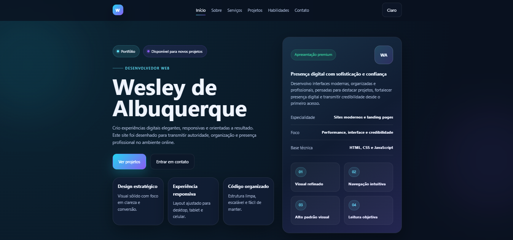

# Wesley de Albuquerque | Portfólio Profissional

Portfólio profissional desenvolvido para apresentar minha identidade, meus serviços, meus projetos e minhas habilidades como desenvolvedor web, com foco em interfaces modernas, sites responsivos e experiências digitais de alto padrão.



## 🔗 Demo

- **Projeto online:** [adicione aqui o link da Vercel]
- **Repositório:** [adicione aqui o link do GitHub]

## 📌 Sobre o projeto

Este projeto foi criado para fortalecer minha presença profissional no ambiente digital, transmitindo autoridade, organização, clareza visual e confiança.

A proposta do site é apresentar meu trabalho de forma elegante e estratégica, reunindo seções essenciais para um portfólio profissional, como apresentação, serviços, projetos, habilidades, processo de trabalho e contato.

## ✨ Funcionalidades

- Seção inicial com apresentação profissional
- Área "Sobre mim" com proposta de valor e posicionamento
- Seção de serviços com foco em landing pages, sites institucionais e interfaces front-end
- Galeria de projetos com filtro por categoria
- Área de habilidades com barras de progresso e stack visual
- Seção de processo com etapas do fluxo de trabalho
- Formulário de contato com chamada para ação
- Alternância de tema
- Navegação responsiva para diferentes dispositivos

## 🛠 Tecnologias utilizadas

As principais tecnologias utilizadas neste projeto foram:

- **HTML5**
- **CSS3**
- **JavaScript**

## 🎯 Objetivo do projeto

O objetivo deste projeto foi construir um portfólio com aparência premium, organização estratégica e navegação intuitiva, capaz de apresentar meus serviços e projetos de forma profissional para clientes, recrutadores e parceiros.

## 📱 Responsividade

O layout foi desenvolvido com foco em responsividade, buscando boa adaptação para:

- Desktop
- Tablet
- Smartphones

## 💡 Destaques do projeto

- Interface refinada e visual premium
- Estrutura pensada para posicionamento profissional
- Navegação intuitiva e leitura objetiva
- Código organizado e de fácil manutenção
- Experiência responsiva em diferentes tamanhos de tela

## 📁 Estrutura do projeto

```bash
portfolio/
├── css/
│   └── style.css
├── img/
│   └── [ imagens do projeto ]
├── js/
│   └── script.js
├── index.html
├── preview.png
└── README.md

🧠 Aprendizados

Durante o desenvolvimento deste projeto, foi possível praticar e aprimorar conhecimentos em:

Estruturação semântica com HTML
Estilização moderna com CSS
Interatividade com JavaScript
Construção de interfaces responsivas
Organização visual para apresentação profissional
Criação de páginas com foco em posicionamento e credibilidade


🔮 Melhorias futuras
Algumas melhorias que podem ser adicionadas futuramente:

Integração real do formulário com e-mail ou WhatsApp
Inclusão de projetos reais com links externos
Otimização de SEO
Animações mais avançadas
Versão multilíngue
Deploy com domínio personalizado


👨‍💻 Autor
Desenvolvido por Wesley de Albuquerque

GitHub: [https://github.com/wesleyyach]
LinkedIn: [https://www.linkedin.com/in/wesley-albuquerque-7272892b7/]


📄 Licença

Este projeto está sob a licença MIT.
Sinta-se à vontade para estudar, adaptar e utilizar como referência.